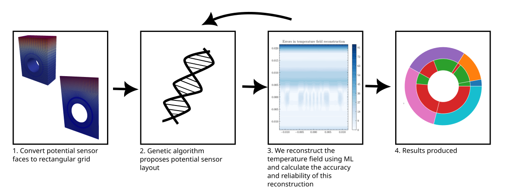

# Introduction to cyclops

These tutorials aim to give you an interactive introduction to cyclops.

## Function prefixes

* `generate_` means generator for initialisation
* `find_` or `calc_` means return a value involving calculation
* `build_` means create a pyplot figure and return it without showing it
* `plot_` function takes an axis as an argument and changes it (for instance by plotting a line on it)

## How does cylcops work?

The package was designed on the Sklearn philosopy of initialise, plan, act (https://scikit-learn.org/stable/developers/develop.html#apis-of-scikit-learn-objects).

Cyclops contains a number of classes for machine learning interpolation and regression, stored in '*regressors.py*'. These have 3 key methods.
* `__init__` where they are initialised with the correct hyperparameters.
* `fit` where they are fitted to data.
* `predict` where they predict an array of output data values given an array of input data values.
The input and output data is always a 2D numpy array of the form `[[x1], [x2], [x3]] or [[x1, y1], [x2, y2], [x3, y3]]`. Not all the regressors can cope with all input data dimensions - the  `CTModel` for instance only applies to 2D input data.

The `Field` objects are vector or scalar fields that use the regressors to take in a position in the field and predict the value of the field at that position. They have 3 key methods.
* `__init__` where they are initialised with the correct parameters.
* `fit_model` where a machine learning model is taught the field data at the known positions in the field so that it can interpolate & extrapolate.
* `predict_values` where an array of positions is input and the predictions for the field values at those points are output.
The simulation file provided in step 1 is converted to a field object. This is referred to as the 'True field'. Field objects are also used by the `SensorSuite` to predict the field values from sensor values.

The `SensorSuite` objects contain sensors and contain use the sensor data they are given to describe a `Field` that they own. They have many different important methods.

The `Experiment` object runs the experiment optimisation.

After all this we analyse the results by plotting plots with the graph manager.

## What do the tutorials cover?

The section 1 tutorials describe how to read a FEM mesh file into python.

The section 2 tutorials describe how to perform a single-objective optimisation (SOO) on a field.

The section 3 tutorials describe how to perform a multi-objective optimisation (MOO) on a field.

The section 4 tutorial shows how to analyse any historic data (for instance if it's just been copied into the results folder from a supercomputer).

# Assumptions

Reading the FEM file:
* The error from interpolating between the FEM nodes with a function other than the FEM shape function is negligible.

Optimisation:
* The FEM temperature field and ML temperature field can be compared well by calculating the MSE between them at many points.
* The heuristic NSGA-II method will produce Pareto-optimal results after a long enough time.
* When so many sensors fail that there are not enough working sensors to use the ML algorithm we count the loss as being no bigger than the greatest loss calculated up to that point.
* We assume that the temperature field measured in the experiment will be extermely similar to the FEM temperature field

Thermocouples:
* The thermocouples measure the average temperature in a specific circular region.
* The thermocouples have a normally distributed random error with a standard deviation equal to 1/3 of 2.2 degrees.
* The thermocouples' voltage is converted to temperature using a linear fit (introducing systematic errors).
